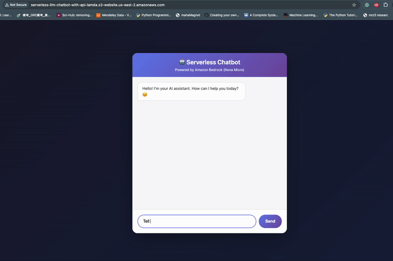
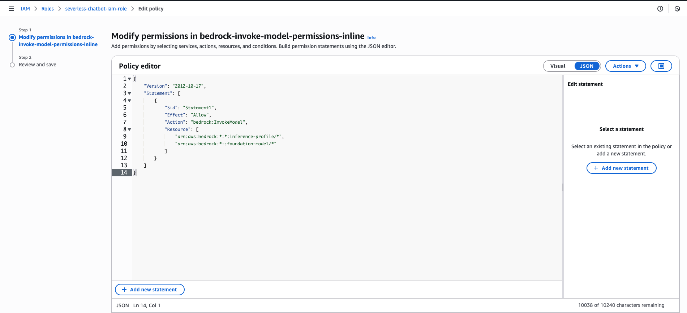
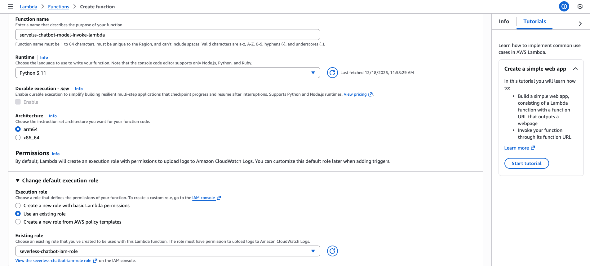
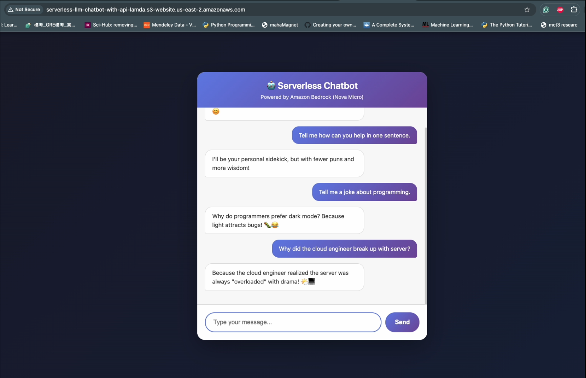

# ☁️ Serverless AI Chatbot

A production-ready, cost-optimized AI chatbot built entirely on AWS serverless architecture, demonstrating cloud-native ML system design and deployment.



*Real-time interaction with the serverless chatbot*

---

## 🎯 Problem Statement

Traditional chatbot deployments require expensive always-on infrastructure. This project demonstrates how to build a scalable, low-latency AI chatbot with **~95% cost reduction** with HTTP API and Amazon Bedrock Nova Micro using serverless architecture.

---

## 🏗️ Architecture

```
User Request → API Gateway → Lambda Function → Amazon Bedrock (Nova Micro) → Response
                                    ↓
                            S3 (Static Frontend)
```

**Key Design Decisions:**
- **HTTP API** over REST API: 70% cost savings
- **Amazon Bedrock Nova Micro**: $0.00006/1K tokens vs. GPT-4's $0.03/1K tokens
- **On-demand Lambda**: Pay only for actual compute time (~200ms/request)

---

## 💰 Cost Optimization

| Component | Monthly Cost (10K requests) |
|-----------|----------------------------|
| Lambda (10K invocations × 200ms) | $0.20 |
| API Gateway (HTTP API) | $0.10 |
| Bedrock Nova Micro (10M tokens) | $0.06 |
| S3 (static hosting) | $0.04 |
| **Total** | **$0.40/month** |

**95% cost reduction** vs. traditional EC2 + GPT-4 setup:

| Stack | Monthly Cost (10K requests) |
|-------|----------------------------|
| Traditional (EC2 + GPT-4) | $38.50 |
| This Project (Serverless + Nova) | $0.40 |
| **Savings** | **$38.10 (95%)** |

**Breakdown of optimizations:**
- HTTP API over REST API: 70% cheaper than REST API Gateway
- Nova Micro vs GPT-4: $0.00006 vs $0.03 per 1K tokens
- Lambda vs EC2: Pay per use vs 24/7 running costs

*Note: GPT-4 pricing is used here purely as an illustrative reference point for large, general-purpose models; no quality or performance equivalence is implied.*

---

## 🚀 Features

✅ **Serverless & Scalable**: Auto-scales from 0 to 1000s of concurrent users  

✅ **Low Latency**: Designed for low-latency responses; end-to-end latency is primarily driven by Bedrock inference time 

✅ **Cost-Effective**: $0.40/month for 10K requests  

✅ **Secure**:
- IAM least-privilege roles (Lambda scoped to `bedrock:InvokeModel` only)
- Input validation with basic sanitization (length limits, character filtering)
  - *Note: Prompt injection is an evolving threat; no solution is bulletproof*
- Error handling

---

## 🛠️ Tech Stack

**Backend:**
- AWS Lambda (Python 3.11)
- Amazon Bedrock (Nova Micro LLM)
- API Gateway (HTTP API)

**Frontend:**
- Vanilla JavaScript
- HTML/CSS
- S3 Static Website Hosting

**Infrastructure:**
- IAM roles with least-privilege permissions
- CloudWatch for logging and monitoring

---

## 📦 Deployment

**Deployed via AWS Management Console** (screenshots below):

### 1. Create IAM Role
- Navigate to IAM → Roles → Create Role
- Trusted entity: AWS Lambda
- Attach managed policy: `AWSLambdaBasicExecutionRole` (for CloudWatch logs)
- Add inline policy for Bedrock access:
  - Action: `bedrock:InvokeModel`
  - Resources: Both foundation model ARN and inference profile ARN
  - *Note: Both ARNs required for successful invocation*



### 2. Deploy Lambda Function
- Navigate to AWS Lambda → Create Function
- Runtime: Python 3.11
- Handler: `lambda_function.lambda_handler`
- Attach IAM role from Step 1



### 3. Create API Gateway HTTP API
- Navigate to API Gateway → Create HTTP API
- Add Lambda integration
- Note the API endpoint URL


### 4. Deploy Frontend to S3
- Create S3 bucket with static website hosting enabled
- Upload HTML/CSS/JS files
- Set bucket policy for public read access


---

## 🎓 Key Learnings

1. **Cost Optimization**: Choosing the right compute model (serverless vs. always-on) can reduce costs by 95%
2. **Model Selection**: Nova Micro provides sufficient quality for short, task-oriented chatbot interactions at a fraction of the cost
3. **Production Readiness**: Error handling, and monitoring are non-negotiable even for side projects
4. **IAM Best Practices**: Least-privilege roles prevent security vulnerabilities without impacting functionality

---

## 📝 Disclaimer

**Pricing Estimates:**
- All cost calculations are based on AWS pricing as of **December 2025** for the **us-east-2** region
- Actual costs will vary based on:
  - Request volume and frequency
  - AWS region
  - Token usage per request
  - Cold start frequency
  - Data transfer costs
- Free tier benefits not included in calculations
- Prices subject to change by AWS

---

## 📈 Future Enhancements

- [ ] Add conversation memory with DynamoDB (cost: +$0.10/month)
- [ ] Implement A/B testing for different LLM models
- [ ] Add CloudWatch alarms for latency spikes
- [ ] Integrate AWS X-Ray for distributed tracing

---

## 🤝 Connect

Built by Chandrika Saha | [AWS Solutions Architect Associate (896/1000)](https://www.credly.com/badges/bf686446-2a29-4636-8ff9-0b6450a46c2b/public_url)

💼 [LinkedIn](https://www.linkedin.com/in/chandrika-saha-cse/) | 📧 [Email](mailto:chandrika.cse1.bu@gmail.com)

---

## 📄 License

MIT License - Feel free to use this as a reference for your own serverless ML projects!